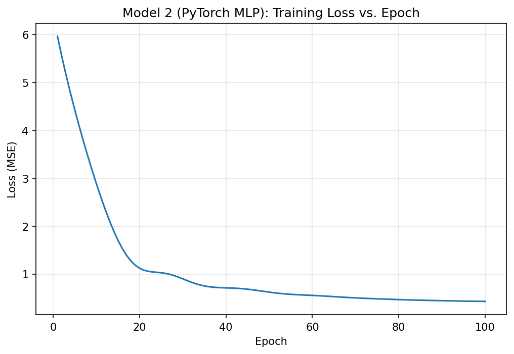

# California Housing: Linear Regression vs. Neural Network

CSCI 4425
Ivan Hinojos 

---

# How to Run

```bash
pip install scikit-learn pandas numpy torch matplotlib
python main.py
```

### Files

| File | What it is |
| --- | --- |
| `main.py` | 
| `README.md` | 
| `loss_curve.png` | 

---

# Part 1: Data Loading and Exploration

### `DESCR`

```
.. _california_housing_dataset:

California Housing dataset
--------------------------

**Data Set Characteristics:**

:Number of Instances: 20640

:Number of Attributes: 8 numeric, predictive attributes and the target

:Attribute Information:
    - MedInc        median income in block group
    - HouseAge      median house age in block group
    - AveRooms      average number of rooms per household
    - AveBedrms     average number of bedrooms per household
    - Population    block group population
    - AveOccup      average number of household members
    - Latitude      block group latitude
    - Longitude     block group longitude

:Missing Attribute Values: None

This dataset was obtained from the StatLib repository.
https://www.dcc.fc.up.pt/~ltorgo/Regression/cal_housing.html

The target variable is the median house value for California districts,
expressed in hundreds of thousands of dollars ($100,000).

This dataset was derived from the 1990 U.S. census, using one row per census
block group. A block group is the smallest geographical unit for which the U.S.
Census Bureau publishes sample data (a block group typically has a population
of 600 to 3,000 people).

A household is a group of people residing within a home. Since the average
number of rooms and bedrooms in this dataset are provided per household, these
columns may take surprisingly large values for block groups with few households
and many empty houses, such as vacation resorts.

It can be downloaded/loaded using the
:func:`sklearn.datasets.fetch_california_housing` function.

.. rubric:: References

- Pace, R. Kelley and Ronald Barry, Sparse Spatial Autoregressions,
  Statistics and Probability Letters, 33:291-297, 1997.
```

### `df.head()`

|    |   MedInc |   HouseAge |   AveRooms |   AveBedrms |   Population |   AveOccup |   Latitude |   Longitude |   MedHouseVal |
|---:|---------:|-----------:|-----------:|------------:|-------------:|-----------:|-----------:|------------:|--------------:|
|  0 |   8.3252 |         41 |    6.98413 |     1.02381 |          322 |    2.55556 |      37.88 |     -122.23 |         4.526 |
|  1 |   8.3014 |         21 |    6.23814 |     0.97188 |         2401 |    2.10984 |      37.86 |     -122.22 |         3.585 |
|  2 |   7.2574 |         52 |    8.28814 |     1.07345 |          496 |    2.80226 |      37.85 |     -122.24 |         3.521 |
|  3 |   5.6431 |         52 |    5.81735 |     1.07306 |          558 |    2.54795 |      37.85 |     -122.25 |         3.413 |
|  4 |   3.8462 |         52 |    6.28185 |     1.08108 |          565 |    2.18147 |      37.85 |     -122.25 |         3.422 |

### `df.describe()`

|       |       MedInc |     HouseAge |     AveRooms |    AveBedrms |   Population |     AveOccup |     Latitude |    Longitude |   MedHouseVal |
|:------|-------------:|-------------:|-------------:|-------------:|-------------:|-------------:|-------------:|-------------:|--------------:|
| count | 20640.000000 | 20640.000000 | 20640.000000 | 20640.000000 | 20640.000000 | 20640.000000 | 20640.000000 | 20640.000000 |  20640.000000 |
| mean  |     3.870671 |    28.639486 |     5.429000 |     1.096675 |  1425.476744 |     3.070655 |    35.631861 |  -119.569704 |      2.068558 |
| std   |     1.899822 |    12.585558 |     2.474173 |     0.473911 |  1132.462122 |    10.386050 |     2.135952 |     2.003532 |      1.153956 |
| min   |     0.499900 |     1.000000 |     0.846154 |     0.333333 |     3.000000 |     0.692308 |    32.540000 |  -124.350000 |      0.149990 |
| 25%   |     2.563400 |    18.000000 |     4.440716 |     1.006079 |   787.000000 |     2.429741 |    33.930000 |  -121.800000 |      1.196000 |
| 50%   |     3.534800 |    29.000000 |     5.229129 |     1.048780 |  1166.000000 |     2.818116 |    34.260000 |  -118.490000 |      1.797000 |
| 75%   |     4.743250 |    37.000000 |     6.052381 |     1.099526 |  1725.000000 |     3.282261 |    37.710000 |  -118.010000 |      2.647250 |
| max   |    15.000100 |    52.000000 |   141.909091 |    34.066667 | 35682.000000 |  1243.333333 |    41.950000 |  -114.310000 |      5.000010 |

---

# Part 4: Model Evaluation

| Model | MSE | RMSE |
| :--- | ---: | ---: |
| Linear Regression | 0.528984 | 0.727313 |
| Neural Network | 0.426908 | 0.653382 |

---

# Part 5: Analysis and Interpretation

## Which model did better?

| Model | MSE | RMSE |
| :--- | ---: | ---: |
| Linear Regression | 0.528984 | 0.727313 |
| Neural Network | **0.426908** | **0.653382** |

Lower is better for both of these.

The neural network performed better than the linear regression model. The MSE went from 0.528984 to 0.426908, which is about a 19% improvement. The RMSE also decreased from 0.727313 to 0.653382. Since the target is measured in units of $100,000, the linear model is off by about $72,700 on a typical block group, while the neural network is off by about $65,300.

I think the main reason the neural network did better is because it can learn more complicated patterns. Linear regression basically tries to fit a straight line to the data, but house prices in California aren't that simple. Latitude and longitude are a good example. More expensive areas are usually closer to the coast, especially around the Bay Area and Los Angeles. This means prices don't just increase or decrease as you move in one direction. The location depends on both latitude and longitude together, which is harder for a linear model to capture.

The neural network is able to handle this better because of its hidden layer and ReLU activation. It can combine different features and find patterns that aren't just straight lines. For example, it can learn that certain combinations of latitude and longitude are connected to higher house prices.

Another thing I noticed is that the neural network was still improving when I stopped training it. The loss hadn't completely leveled off by epoch 100, so 0.426908 might not be the best result the model could get. It was just the result at the point where training stopped. Linear regression doesn't have this issue because it calculates the best-fitting parameters directly, so training it for longer wouldn't change its results.

## Loss curve



The loss drops really quickly at the beginning and then starts to slow down a lot. For example, from epoch 10 to 20, the loss drops by about 1.77, going from 2.886819 to 1.120220. But from epoch 90 to 100, it only drops by about 0.015, going from 0.442726 to 0.428121. So, the model is making way less progress toward the end compared to the beginning.

I think the early epochs are when the network is learning the basic stuff. It starts with random weights, so its first predictions are pretty far off. The actual target values average around 2.07, while the first predictions are close to zero. Just getting the predictions into the right general range removes a lot of the error. After that, the network has to learn the more complicated relationship between the different features and house prices, which takes more time.

The curve also stays pretty smooth the entire time. There aren't any big jumps or spikes, which makes me think the learning rate of 0.01 was a good choice. If the learning rate was too high, the loss could jump around or even get worse. If it was too low, the loss would probably decrease really slowly.

The biggest thing I noticed from the plot is that the model hasn't fully converged yet. At epoch 100, the loss is still going down instead of completely flattening out. One reason for this is that the model is training on all 16,512 rows at once, meaning each epoch only results in one weight update. So, after 100 epochs, the model has only made 100 updates. If I trained it for more epochs, or used mini-batches so that there are multiple updates per epoch, the loss would probably continue to decrease.
